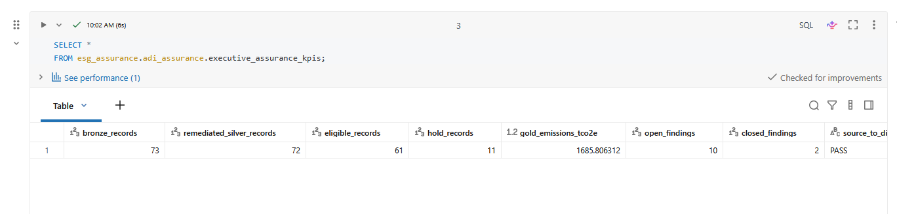
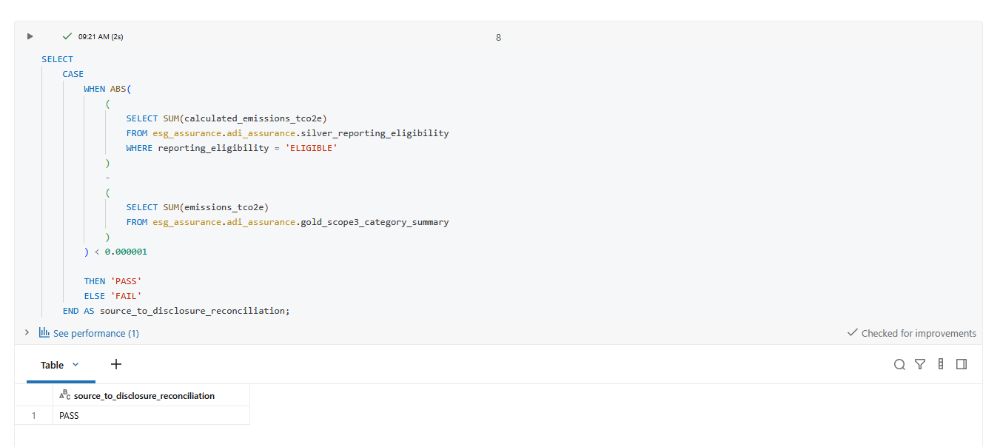
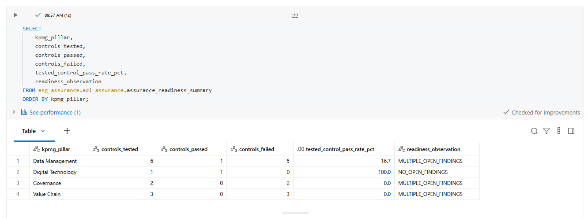

# ESG Assurance Readiness & Data Governance Analytics

This portfolio project demonstrates how ESG data can be prepared for assurance by making it traceable, controlled, reproducible, and supported by evidence before it enters external reporting.
The project focuses on the data and control layer behind ESG reporting rather than only the final sustainability metrics.

It combines:

- ESG data governance
- Scope 3 control testing
- Bronze / Silver / Gold data architecture
- data-quality validation
- evidence traceability
- exception management
- reconciliation
- assurance workpapers
- reporting eligibility
- executive assurance-readiness reporting

The workflow was built using Databricks, SQL, Python, and analytical reporting outputs.

> This is a portfolio and training project. Synthetic data are used to demonstrate the assurance-readiness workflow and should not be interpreted as actual company reporting data. Public Analog Devices sustainability, Scope 3, methodology, and assurance materials are used only as real-world context; all transaction-level data, controls, exceptions, and workpapers are synthetic case-study materials.

---

## Business Question

**How can ESG data be governed, tested, traced, and documented so that management and an independent reviewer can understand where a reported number came from, what controls were applied, what exceptions remain, and whether the data are ready for assurance?**

The project addresses questions such as:

- Where did the ESG value come from?
- Who owns the data?
- Was the methodology valid?
- Was supporting evidence available?
- Did the record pass required controls?
- Were exceptions identified and documented?
- Was remediation performed?
- Can the result be reproduced?
- Should the record be included in governed reporting?

---

## What Assurance Readiness Means

For this project, assurance readiness means making ESG information:

**traceable, reproducible, controlled, and evidence-supported before an independent reviewer examines it.**

A reported number should be connected to:

**source → transformation → control → evidence → exception → remediation → approval**

The goal is not only to calculate ESG metrics.

The goal is to make those metrics defensible.

---

## Data Governance Framework

The project uses a simple governance sequence:

**Define → Own → Source → Check → Trace → Approve**

### Define

Establish clear definitions for fields, metrics, methods, and statuses.

Examples include:

- reporting boundary
- emissions method
- evidence status
- exception severity
- reporting eligibility

### Own

Assign responsibility for the data and the control.

Typical roles include:

- data owner
- data steward
- data producer
- technical custodian
- reviewer

### Source

Preserve where the original value came from.

This includes distinguishing:

- source values
- standardized values
- governed values
- calculated values
- reported values

### Check

Apply validation and assurance controls.

Examples include:

- completeness
- validity
- consistency
- uniqueness
- methodology
- evidence
- reconciliation

### Trace

Maintain a visible lineage from source to reporting output.

### Approve

Only records that satisfy the required governance and control conditions should enter governed reporting.

---

## Governance vs Data Management

I treat data governance and data management as related but different.

**Data management** is about moving, storing, transforming, and maintaining data.

**Data governance** is about deciding:

- what the data means
- who owns it
- which rules apply
- what quality is acceptable
- what evidence is required
- who can approve it

A simple analogy is:

> Data management is driving the car.  
> Data governance is the traffic rules, road signs, licensing, and accountability system.

Both are necessary.

---

## Solution Architecture

```text
Synthetic ESG source data
          |
          v
       BRONZE
Raw ingestion and source preservation
          |
          v
       SILVER
Standardization
Data-quality validation
Method validation
Evidence validation
Exception identification
          |
          v
        GOLD
Governed reporting tables
Reconciliation
Exception register
Assurance workpaper
Readiness summary
          |
          v
 EXECUTIVE REPORTING
Assurance readiness
Open exceptions
Control status
Reporting eligibility
Management conclusion
```

---

## Bronze / Silver / Gold Design

### Bronze

The Bronze layer preserves raw source information.

The purpose is to keep an unchanged reference point before applying business rules.

Typical responsibilities include:

- source ingestion
- source preservation
- schema capture
- basic technical validation

---

### Silver

The Silver layer standardizes and tests the data.

Examples include:

- field standardization
- data-type validation
- completeness checks
- business-rule validation
- methodology checks
- evidence-status checks
- exception classification

The Silver layer answers:

**Can this record be trusted enough to move forward?**

---

### Gold

The Gold layer contains governed outputs used for reporting and assurance.

Examples include:

- reporting transactions
- reconciliations
- exception registers
- assurance workpapers
- assurance-readiness summaries

The Gold layer answers:

**What can management and an independent reviewer actually use?**

---

## Control Framework

The project separates several related concepts.

### Data Quality

Is the source information complete, valid, consistent, and appropriately structured?

### Control Performance

Did the record pass the required validation or assurance control?

### Reporting Eligibility

Can the record enter governed reporting?

### Assurance Readiness

Is the reporting process sufficiently traceable, documented, and evidence-supported for an independent reviewer?

These concepts are related but not identical.

---

## Important Assurance Principle

A key principle in this project is:

> **A control failure does not automatically mean a confirmed misstatement.**

A failed control may indicate:

- missing evidence
- unsupported methodology
- incomplete documentation
- unresolved review
- data-quality weakness

The issue must be investigated before concluding that the reported value itself is wrong.

---

## Control Outcomes

Control tests can produce outcomes such as:

- `PASS`
- `REVIEW`
- `FAIL`
- `N/A`

These outcomes are used to determine whether a record requires additional work before reporting.

---

## Reporting Eligibility

The final reporting gate uses three statuses:

### ELIGIBLE

The required conditions are satisfied and the record can enter governed reporting.

### REVIEW

The record may be valid, but additional judgment, documentation, or evidence is required.

### HOLD

A material unresolved issue prevents the record from entering governed reporting.

Conceptually:

```text
Required controls satisfied
→ ELIGIBLE

Material unresolved issue
→ HOLD
```

---

## Exception Management

Control failures and review items are documented in an exception register.

Each exception can include:

- record identifier
- exception type
- severity
- exception reason
- control owner
- remediation action
- evidence required
- review status
- retest result
- closure status

This turns data validation into an operational remediation process.

Instead of simply saying:

**“This record failed.”**

the workflow asks:

**“Why did it fail, who owns the fix, what evidence is required, and has the issue been retested?”**

---

## Evidence and Traceability

Evidence is central to assurance readiness.

The project distinguishes among:

- evidence available
- evidence reviewed
- evidence approved
- evidence verified
- evidence missing

A document existing in a folder does not automatically make a value assurance-ready.

The important question is:

**Can the reviewer connect the evidence to the reported value and understand why it is sufficient?**

---

## Assurance Workpaper

The project includes an assurance workpaper designed to summarize:

- the control tested
- the reporting assertion
- the source record
- the evidence reviewed
- the result
- the exception
- the reviewer conclusion
- remediation status

The workpaper acts as a bridge between the data pipeline and an assurance review.

---

## Reporting Assertions

The assurance workflow can support common reporting assertions such as:

### Completeness

Are all relevant records included?

### Accuracy

Are calculations and values correct?

### Validity

Does the reported item meet the required methodology or definition?

### Consistency

Are methods applied consistently across records and periods?

### Traceability

Can the reported value be traced to source data and evidence?

### Classification

Is the record assigned to the correct reporting category?

---

## Reconciliation

Reconciliation is used to verify that records and values move correctly through the pipeline.

Examples include:

```text
Source population
=
Eligible
+
Review
+
Hold
```

and:

```text
Calculated emissions
=
Reported emissions
+
Excluded emissions
```

Reconciliation provides an important assurance check because it confirms that records have not been lost, duplicated, or incorrectly excluded during transformation.

---

## Key Data-Quality Finding

73 source records
→ duplicate identified
→ 72 remediated records
→ 61 ELIGIBLE
→ 11 HOLD
→ Gold reconciliation PASS
→ overall assurance readiness assessed
---

## Assurance Readiness Assessment

The final readiness assessment combines information from:

- control results
- data-quality checks
- exception status
- evidence sufficiency
- reconciliation
- reporting eligibility

The overall readiness conclusion in the project is:

**PARTIALLY READY**

This means the reporting structure and control framework exist, but unresolved issues remain before the full population would be considered assurance-ready.

---

## Assurance Maturity

The project also illustrates how assurance readiness can be viewed as a maturity journey.

### Level 1 — Ad Hoc

Data are manually collected with limited ownership or documentation.

### Level 2 — Defined

Definitions and responsibilities begin to be standardized.

### Level 3 — Controlled

Validation rules, evidence requirements, and exception tracking are implemented.

### Level 4 — Assurance Ready

Reported values are traceable, reproducible, reconciled, and supported by evidence.

### Level 5 — Continuously Monitored

Controls, exceptions, and evidence are monitored systematically and improved over time.

The project demonstrates movement toward the controlled and assurance-ready stages.

---

## Databricks Workflow

The analytical pipeline is organized into five main notebooks:

```text
01_bronze_ingestion.ipynb
02_silver_validation.ipynb
03_gold_reporting.ipynb
04_assurance_workpaper.ipynb
05_executive_assurance_dashboard.ipynb
```

### 01 — Bronze Ingestion

Loads and preserves the synthetic ESG source data.

### 02 — Silver Validation

Applies data-quality and control logic.

### 03 — Gold Reporting

Creates governed reporting and reconciliation outputs.

### 04 — Assurance Workpaper

Creates a structured review layer connecting records, controls, evidence, and conclusions.

### 05 — Executive Assurance Dashboard

Summarizes assurance readiness and management-level findings.

---

## Project Outputs

The main outputs include:

- governed ESG reporting data
- data-quality validation results
- exception register
- reconciliation results
- assurance workpaper
- assurance findings
- executive assurance-readiness summary

---

## Project Results

The project demonstrates how raw ESG data can be converted into a controlled reporting population.

The most important result is not a single sustainability number.

It is the ability to answer:

> **Can this number be traced, reproduced, supported, reviewed, and defended?**

That is the core of assurance readiness.

---

## Executive Reporting

The executive reporting layer focuses on questions management would care about:

- How much of the reporting population is ready?
- How many records remain under review?
- How many are on hold?
- What types of exceptions remain?
- Which issues are material?
- Who owns remediation?
- Has the dataset reconciled?
- What is the overall readiness conclusion?

---

## Project Visuals

### Reporting Eligibility



### Gold Reconciliation



### Assurance Readiness Summary



---

## Documentation

Additional project documentation is available in:

- [`docs/methodology.md`](docs/methodology.md)
- [`docs/control-framework.md`](docs/control-framework.md)
- [`docs/assurance-findings.md`](docs/assurance-findings.md)
- [`docs/sources.md`](docs/sources.md)

---

## Technology Stack

- Databricks
- Delta Lake
- SQL
- Python
- pandas
- Jupyter notebooks
- ESG control logic
- data-quality validation
- assurance documentation

---

## Repository Structure

```text
esg-assurance-readiness-data-governance/
│
├── README.md
│
├── assets/
│   ├── reporting-eligibility.png
│   ├── gold-reconciliation.png
│   └── assurance-readiness-summary.png
│
├── data/
│   ├── README.md
│   └── synthetic/
│
├── docs/
│   ├── methodology.md
│   ├── control-framework.md
│   ├── assurance-findings.md
│   └── sources.md
│
└── notebooks/
    ├── 01_bronze_ingestion.ipynb
    ├── 02_silver_validation.ipynb
    ├── 03_gold_reporting.ipynb
    ├── 04_assurance_workpaper.ipynb
    └── 05_executive_assurance_dashboard.ipynb
```

---

## What I Learned

The biggest lesson from this project is that assurance readiness is not mainly about checking numbers at the end.

It starts much earlier.

A reliable ESG reporting process needs:

**clear definitions  
→ ownership  
→ controlled source data  
→ validation  
→ evidence  
→ exception management  
→ reconciliation  
→ approval**

That is why data governance and assurance readiness are so closely connected.

The stronger the governance and traceability are upstream, the easier it becomes to defend the final ESG report.

---

## Limitations

This is a portfolio and training project.

Key limitations include:

- synthetic source data
- illustrative control logic
- no independent external assurance opinion
- no claim that the workflow represents an official company reporting system
- assurance conclusions are demonstration outputs rather than formal audit conclusions

The purpose is to demonstrate the design of an ESG assurance-readiness workflow, not to provide an external assurance opinion.

---

## Portfolio Summary

This project demonstrates an end-to-end ESG assurance-readiness workflow:

**source data  
→ data governance  
→ validation  
→ control testing  
→ exceptions  
→ remediation  
→ reconciliation  
→ workpaper  
→ reporting eligibility  
→ assurance readiness**

The central idea is simple:

> **Before ESG data can be assured, it has to be governed.**
